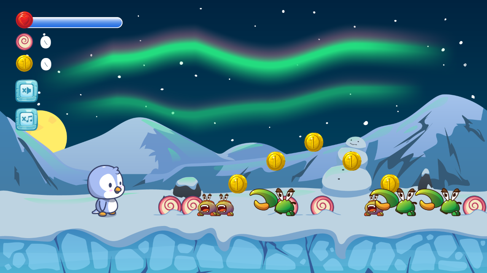

# Super Candy Penguin

A browser-based 2D jump-and-run game built with JavaScript, HTML5 Canvas, and object-oriented programming principles.

The project focuses on structured game logic, collision handling, and real-time rendering in a modular frontend architecture.

---

## Live Demo

[Play the game](https://supercandypenguin.dominik-troendle.de/)

---

## About the Project

Super Candy Penguin is a side-scrolling platformer where the player controls a penguin navigating through obstacles, collecting items, and avoiding enemies.

The project was built to deepen my understanding of game mechanics in JavaScript, including animation loops, collision detection, and state management.

---

## Features

* Side-scrolling jump-and-run gameplay
* Player movement with gravity and jumping mechanics
* Enemy interactions and collision detection
* Collectible items and score tracking
* Sprite-based animations
* Sound effects and visual feedback
* Game state handling (start, running, game over)
* Responsive design across devices

---

## Tech Stack

* **HTML5 Canvas**
* **JavaScript (ES6+)**
* **CSS**
* **Object-Oriented Programming (OOP)**

---

## Getting Started

### Installation

```bash
npm install
```

### Run locally

**Since this project is a browser-based game without a build step**:
* Option 1: Use Live Server (VS Code extension)
* Option 2: Open index.html directly in your browser

---

## Project Structure

```text
├── audio/          # Audio and music files
├── classes/        # Game object classes (player, enemies, world, etc.)
├── font/           # Font files
├── img/            # Images, sprites
├── levels/         # Level configuration and data
├── scripts/        # Core game logic and initialization
├── styles/         # Font implementation
├── index.html      # Game entry point
```

---

## Key Concepts

* **Game loop architecture using requestAnimationFrame**
* **Collision detection between dynamic objects**
* **State-based game logic (idle, running, game over)**
* **Object-oriented design for entities and behaviors**
* **Sprite animation handling**
* **Separation of rendering and logic**

---

## Author

Dominik Tröndle
Frontend Developer based in Munich

---

## Preview

